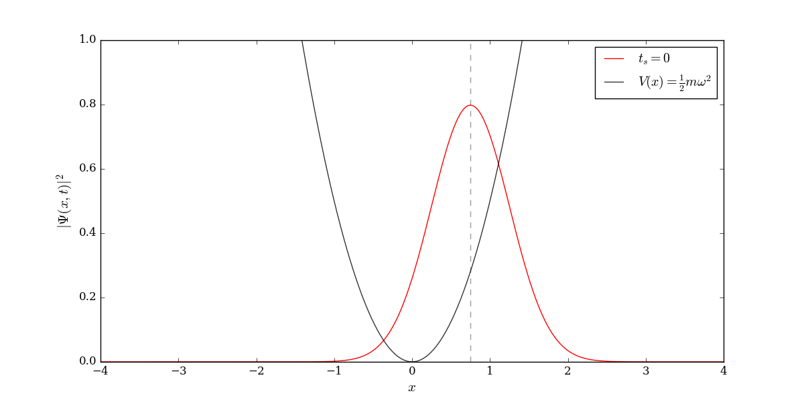
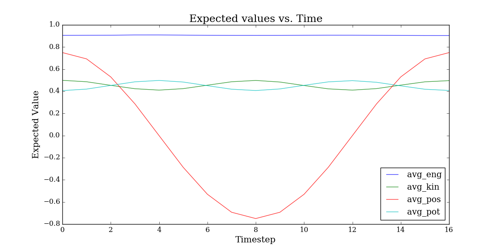

### Description
Quantum particle in a harmonic oscillator potential with gaussian initial condition. Wave function and expected values for variables of motion solved numerically using a Feynman path integral.

### Usage

Compute wave function:
`make`

Make plots and animation:
`python plot.py 
convert -delay 20 -loop 0 plots/phi/*.png plots/wave_evolution.gif`

yay.